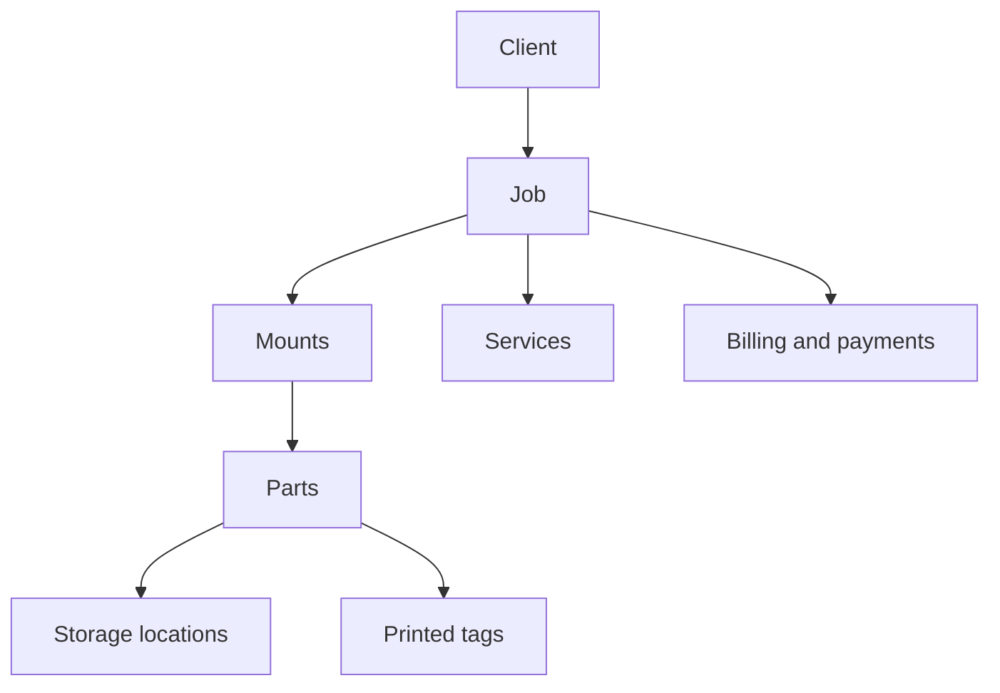

MountMonitor connects the work in your shop to the client it belongs to. Understanding these records helps you find the right place to make a change.

## Start with the client and job

A **client** is your customer. One client can have several **jobs**. Each job brings together that client's mounts and services, job details, files, and billing records.

A client can have more than one job, and a job can contain more than one mount or service. The diagram shows the main relationships for one job.

## Mounts, services, and parts

A **mount** has its own instructions and progress stage. A **service** records other work on the job and can be linked to a mount.

A mount can have separate **parts**. For example, a deer shoulder mount may have a cape and antlers stored in different places. Locations help you track those parts. Printed tags help you identify them.

## Three different kinds of status

| Information | What it tells you |
| --- | --- |
| Mount stage | Where a mount is in your work process |
| Active or closed job | How the job is organized in your records |
| Payment status and balance | What has been recorded as paid and what is still owing |

These describe different things. The guides for stages, closing jobs, and payments explain how to update each one.

## Two meanings of tags

**Job tags** and **client tags** are labels for organizing records. **Printed tags** are physical labels used to identify mounts, parts, locations, or stock.

## Where to go next

- [Understand jobs](/jobs/overview)
- [Understand mounts and services](/mounts-and-services/overview)
- [Understand parts and locations](/parts-and-locations/overview)
- [Payments](/payments/overview)
- [Understand tags and printing](/tags-and-printing/overview)
